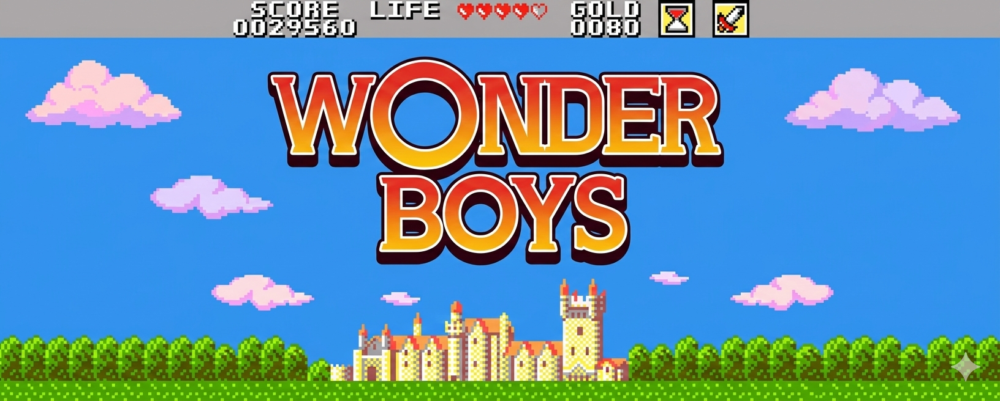

# Wonderboys 🛡️⚔️

Jeu de plateau inspiré de l’univers **Donjons & Dragons**, développé en **Java**.  
Un personnage avance sur un plateau de **64 cases** en lançant un dé virtuel. [file:3][file:4]

## Fonctionnalités
- Création d’un personnage (**Warrior** ou **Wizard**) avec nom, points de vie et force d’attaque. [file:4]
- Gestion d’un plateau de 64 cases avec déplacement via un dé virtuel. [file:4]
- Menu texte pour créer, afficher, modifier le personnage et lancer la partie. [file:4]
- Affichage de la progression du joueur case par case jusqu’à la fin du plateau. [file:4]

## Technologies utilisées
- **Langage** : Java
- **Paradigme** : Programmation orientée objet (classes, héritage, classes abstraites). [file:2][file:4]
- **Outils** : IntelliJ IDEA, UML (diagramme de classes) via draw.io ou Umletino. [file:2][file:4]

## Prérequis
- Java installé (JDK 17 ou version compatible).
- Un IDE Java (IntelliJ, Eclipse, VS Code avec extension Java).
- Git installé si tu utilises GitHub. [file:4]

## Installation
1. Cloner le dépôt :
   ```bash
   git clone https://github.com/rdesfonds-campus/wonderboy.git
